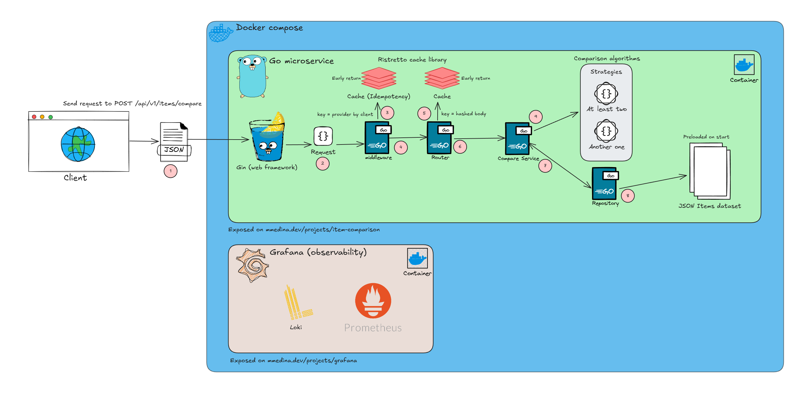
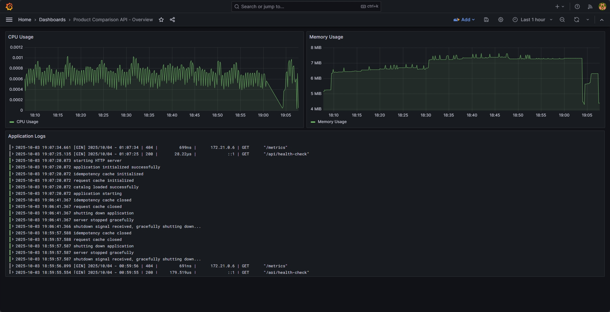

# Item Comparison API

Una API RESTful robusta y escalable para comparar productos de manera inteligente, construida con Go y siguiendo principios de Clean Architecture.



## Indice

- [Descripción](#descripción)
- [Stack](#stack)
- [Estructura de Archivos](#estructura-de-archivos)
- [Arquitectura y Patrones](#arquitectura-y-patrones)
- [Diseño de la API](#diseño-de-la-api)
- [Endpoints Principales](#endpoints-principales)
- [Setup Instructions](#setup-instructions)
- [Decisiones de Arquitectura](#decisiones-de-arquitectura)
- [Características Destacadas](#características-destacadas)

---

## Descripción

Esta API permite comparar múltiples productos de un catálogo de e-commerce (simulacion), identificando campos compartidos y calculando qué producto es "mejor" según métricas predefinidas. La aplicación está diseñada para ser extensible, mantenible.

### ¿Qué hace diferente a esta API?

- **Comparación inteligente**: No solo muestra diferencias, sino que determina qué producto es mejor en cada categoría (cuando son campos compatibles)
- **Estrategias flexibles**: Sistema de estrategias intercambiables para diferentes modos de comparación
- **Cache multinivel**: Request cache + Idempotency cache para optimización de performance
- **Observabilidad completa**: Logs estructurados, métricas y dashboards incluidos
- **Production-ready**: Dockerizada con stack completo de monitoreo (Grafana, Prometheus, Loki)

---

## Stack

### Core

| Tecnología | Propósito |
|------------|-----------|
| **Go** | Lenguaje principal |
| **Gin** | Web framework |
| **Zap** | Logging estructurado |
| **Ristretto** | Cache in-memory de alta performance |

### Observabilidad

| Tecnología | Propósito |
|------------|-----------|
| **Prometheus** | Recolección de métricas |
| **Grafana** | Visualización y dashboards |
| **Loki** | Agregación de logs |
| **Promtail** | Recolector de logs |
| **cAdvisor** | Métricas de contenedores |

### Libs

| Tecnología | Propósito |
|------------|-----------|
| **goccy/go-json** | Parser JSON de alta velocidad |
| **validator** | Validación de requests |
| **godotenv** | Manejo de variables de entorno |

---

## Gen AI en el desarrollo moderno

Yo veo la Inteligencia Artificial Generativa (Gen AI) como una herramienta que realmente nos ayuda en el desarrollo moderno, siempre y cuando sepamos usarla bien y darle las instrucciones correctas. Para mí, no se trata de reemplazar al desarrollador, sino de aprovecharla como un apoyo que nos permite optimizar tiempo y enfocarnos en lo que realmente importa: la arquitectura, los patrones de diseño y las buenas prácticas.

En mi experiencia, la Gen AI facilita mucho el trabajo en tareas simples o repetitivas, como generar código base, escribir documentación o crear casos de prueba iniciales. Además, también sirve para inspirarse con ejemplos de arquitecturas o validaciones que ya son estándar en la industria, lo cual acelera el proceso de desarrollo.

Creo que el valor está en que, si uno ya tiene claro lo que quiere lograr y entiende las bases del desarrollo, la Gen AI se convierte en un aliado muy potente. Nos ayuda a crear más rápido, a experimentar con ideas y a mantener un flujo de trabajo más ágil, sin sacrificar calidad.

---


## Estructura de Archivos

```
internal/
├── domain/
│   ├── item.go              # Modelo de Item
│   ├── compare.go           # Modelos de comparación (Request, Result, Metadata)
│   └── errors.go            # Códigos y respuestas de error
├── service/
│   ├── compare_service.go   # Servicio principal de comparación
│   └── strategy/
│       ├── strategy.go      # Interface del Strategy Pattern
│       ├── at_least_two.go  # Implementación estrategia "at_least_two"
│       └── metrics.go       # Mapeo hardcodeado de métricas por campo
├── data/
│   └── catalog_repo.go      # Repositorio con carga desde JSON e índice en memoria
├── cache/
│   ├── request_cache.go     # Cache de respuestas usando Ristretto
│   └── idempotency.go       # Cache de idempotencia
├── http/
│   ├── handlers/
│   │   └── compare_handler.go    # Handler HTTP del endpoint
│   └── middleware/
│       └── idempotency.go        # Middleware de idempotencia
├── adapters/in/http/router/
│   └── router.go            # Router actualizado con nuevo endpoint
├── app/
│   └── bootstrap.go         # Bootstrap de la aplicación (actualizado)
└── shared/config/
    └── config.go            # Configuración extendida

cmd/product-comparison-api/
└── main.go                  # Main actualizado con graceful shutdown
```

---

## Arquitectura y Patrones

### Arquitectura Hexagonal (Ports & Adapters)

Decidí usar arquitectura hexagonal porque quería **separar claramente la lógica de negocio de los detalles de implementación**. Esto me permite:

1. **Testear el dominio sin infraestructura**: Los modelos de dominio no dependen de HTTP, DB o caches
2. **Cambiar tecnologías fácilmente**: Puedo reemplazar Gin por otro framework sin tocar la lógica
3. **Escalar independientemente**: Cada capa tiene su responsabilidad bien definida

### Patrones Implementados

#### 1. **Strategy Pattern**

Uso este patrón porque sabía que iba a necesitar **diferentes modos de comparación** en el futuro. Actualmente tengo `AtLeastTwo` (compara campos presentes en al menos 2 productos), pero puedo agregar fácilmente `Intersection` o `Union` sin modificar el servicio principal.

```go
type Interface interface {
    Name() string
    ResolveFields(items []Item, requested *[]string) []string
    ComputeDiff(ctx context.Context, items []Item, resolved []string) (map[string]DiffField, error)
}
```

#### 2. **Repository Pattern**

Aísla el acceso a datos. Hoy leo de un JSON, mañana podría ser PostgreSQL o MongoDB sin cambiar la lógica de negocio.

```go
type CatalogRepository interface {
    GetByIDs(ctx context.Context, ids []string) ([]Item, []string)
}
```

#### 3. **Dependency Injection**

Todas las dependencias se inyectan en el constructor. Esto hace el código testeable y desacoplado.

```go
func NewCompareService(repo CatalogRepository, logger *zap.Logger) *CompareServiceImpl
```

#### 4. **Guard Clauses (Early Return)**

Prefiero validar al inicio y retornar temprano en lugar de anidar múltiples `if`. Hace el código más legible.

```go
if len(uniqueIDs) < 2 {
    return error // Sale inmediatamente
}
// Happy path
```

---

## Diseño de la API

### Principios de Diseño

#### 1. **Versionado de API** (`/v1`)

Incluí versionado desde el inicio porque **no quiero romper clientes existentes** cuando agregue nuevas features. La v2 puede coexistir con v1.

```
/api/v1/items/compare  ← Versión actual
/api/v2/items/compare  ← Futuro (más campos, diferentes métricas)
```

#### 2. **RESTful + JSON**

- **POST** para comparación (no es idempotente por naturaleza, pero lo hice idempotente con middleware)
- **JSON** por su ubicuidad y facilidad de consumo
- **Errores descriptivos** con códigos específicos (`AtLeastTwoIds`, `IdNotFound`, etc.)

#### 3. **Idempotencia Opcional**

Implementé idempotencia con el header `Idempotency-Key` porque en ambientes distribuidos **las requests pueden duplicarse** (retry de cliente, problemas de red). Esto garantiza que hacer la misma request 2 veces produce el mismo resultado.

#### 4. **Cache Multinivel**

- **Request Cache**: Cachea por IDs de productos (evita re-procesar comparaciones idénticas)
- **Idempotency Cache**: Cachea por `Idempotency-Key` (garantiza idempotencia)

---

## Endpoints Principales

### **POST** `/api/v1/items/compare`

Compara múltiples productos y retorna un análisis detallado.

#### Request

```json
{
  "ids": [
    "4897b2e4-fb8f-4aa3-b35a-a90594eb0d4d",
    "30106bcd-f425-4dfb-8ef6-055ab4744f6c"
  ],
  "fields": ["price", "rating", "specifications.sensor_dpi"] // Opcional
}
```

#### Response (200 OK)

```json
{
  "data": {
    "items": [
      {
        "id": "4897b2e4-fb8f-4aa3-b35a-a90594eb0d4d",
        "name": "Pro Mouse HP 2",
        "price": 34.24,
        "rating": 4.0,
        "specifications": {
          "sensor_dpi": 18000,
          "buttons": 2,
          "wireless": true
        }
      }
    ],
    "shared_fields": [
      "price",
      "rating",
      "specifications.buttons",
      "specifications.sensor_dpi",
      "specifications.wireless"
    ],
    "diff": {
      "price": {
        "values": {
          "4897b2e4-fb8f-4aa3-b35a-a90594eb0d4d": 34.24,
          "30106bcd-f425-4dfb-8ef6-055ab4744f6c": 23.26
        },
        "metric": "lower_is_better",
        "best": ["30106bcd-f425-4dfb-8ef6-055ab4744f6c"]
      },
      "specifications.wireless": {
        "values": {
          "4897b2e4-fb8f-4aa3-b35a-a90594eb0d4d": true,
          "30106bcd-f425-4dfb-8ef6-055ab4744f6c": false
        },
        "metric": "true_is_better",
        "best": ["4897b2e4-fb8f-4aa3-b35a-a90594eb0d4d"]
      }
    }
  },
  "metadata": {
    "order": ["4897b2e4-fb8f-4aa3-b35a-a90594eb0d4d", "..."],
    "compare_policy": {
      "effective_mode": "at_least_two",
      "comparability_score": 1.0
    },
    "currency": "USD",
    "version": "1.0"
  },
  "error": null
}
```

#### Casos de Error

| Código HTTP | Error Code | Descripción |
|-------------|------------|-------------|
| 400 | `MissingField` | Falta el campo `ids` |
| 404 | `IdNotFound` | Algunos IDs no existen |
| 422 | `AtLeastTwoIds` | Se necesitan al menos 2 IDs únicos |
| 422 | `UnknownField` | Campos solicitados no existen |
| 409 | `Conflict` | Mismo `Idempotency-Key` con diferente body |

---

### **GET** `/api/health-check`

Health check simple para monitoreo (Quizas cuando se tenga algun servicio externo o conexion realizar la validacion de funcionamiento de ese servicio).

#### Response (200 OK)

```json
{
  "status": "OK"
}
```

---

## Setup Instructions

### Prerequisitos

- **Go** 1.25.1+ ([Instalar](https://golang.org/doc/install))
- **Docker** + **Docker Compose** ([Instalar](https://docs.docker.com/get-docker/))
- **Make** (opcional, para comandos útiles)

---

### Docker

La forma más rápida de levantar todo el stack (API + Grafana + Prometheus + Loki).

#### 1. Clonar el repositorio

```bash
git clone https://github.com/tu-usuario/product-comparison-api.git
cd product-comparison-api
```

#### 2. Levantar el stack completo

```bash
# Con docker-compose
docker compose up -d --build

# O con Makefile
make up-build
```

Esto levanta **6 contenedores**:
- `product-comparison-api` (puerto 8080)
- `grafana` (puerto 3000)
- `prometheus` (puerto 9090)
- `loki` (puerto 3100)
- `promtail`
- `cadvisor` (puerto 8081)

#### 3. Verificar que funciona

```bash
# Health check
curl http://localhost:8080/api/health-check

# Comparar productos
curl -X POST http://localhost:8080/api/v1/items/compare \
  -H "Content-Type: application/json" \
  -d '{
    "ids": [
      "4897b2e4-fb8f-4aa3-b35a-a90594eb0d4d",
      "30106bcd-f425-4dfb-8ef6-055ab4744f6c"
    ]
  }'
```

#### 4. Acceder a servicios

- **API**: http://localhost:8080
- **Grafana**: http://localhost:3000 (root / toor)
- **Prometheus**: http://localhost:9090

---

### Comandos Útiles (Makefile)

```bash
make help              # Ver todos los comandos

# Desarrollo
make build             # Compilar binario
make run               # Ejecutar local
make test              # Ejecutar tests

# Docker
make up                # Levantar stack
make up-build          # Build + levantar
make down              # Detener
make logs              # Ver logs
make logs-api          # Ver logs solo de la API
make restart-api       # Reiniciar solo la API

# Testing
make health            # Health check
make test-compare      # Probar endpoint de comparación

# Monitoreo
make open-grafana      # Abrir Grafana
make open-prometheus   # Abrir Prometheus
make stats             # Ver uso de recursos
```

---

## Decisiones de Arquitectura

### ¿Por qué utilizar Go y no otros lenguajes?

Elegí Go principalmente por el performance. En un entorno como Mercado Libre, donde millones de usuarios interactúan constantemente con nuestros servicios, cada milisegundo importa: un servicio que tarda en responder puede hacer que un cliente pierda interés y se vaya antes de completar su acción.

Go ofrece justo lo que necesitamos: compilación a binarios estáticos, concurrencia nativa muy ligera (goroutines) y un runtime diseñado para manejar altos volúmenes de tráfico con baja latencia. Además, su simplicidad en la sintaxis y el ecosistema maduro para construir microservicios lo convierten en una herramienta perfecta para garantizar escalabilidad y mantener una experiencia de usuario fluida incluso bajo carga extrema.

### ¿Por qué Arquitectura Hexagonal?

Para mi una aplicacion escalable es utilizar este tipo de arquitecturas. Arquitectura hexagonal me permite:

1. **Testear sin infraestructura**: Puedo probar la lógica de comparación sin HTTP o caches
2. **Cambiar tecnologías fácilmente**: Hoy uso JSON, mañana puedo usar PostgreSQL cambiando solo el adapter
3. **Desarrollar en paralelo**: Diferentes devs pueden trabajar en handlers, servicios y repos sin conflictos

### ¿Por qué Strategy Pattern?

Actualmente tengo el modo `at_least_two` (compara campos presentes en ≥2 productos), pero sabía que necesitaría otros modos:
- `intersection`: Solo campos presentes en **todos**
- `union`: Todos los campos, con `null` si no existe
- `category_aware`: Diferentes métricas según categoría del producto

Con Strategy, agregar un nuevo modo es **crear una clase nueva**, sin tocar el servicio existente (Open/Closed Principle).

### ¿Por qué Ristretto para cache?

Dado que es un proyecto piloto no se utilizo redis, pero bien pudo haberse implementado, para mejorar la facilidad se utilizo la libreria `Ristretto`

Ristretto es un cache **LRU de alta performance** diseñado para Go. Benchmarks muestran que es más rápido que alternatives como go-cache o BigCache. Además, tiene features como:
- TTL automático
- Eviction inteligente
- Thread-safe sin locks explícitos

### ¿Por qué Idempotencia?

En ambientes de producción, **las requests se duplican** (retry de cliente, load balancers, problemas de red). Sin idempotencia, podrías procesar la misma comparación múltiples veces, desperdiciando recursos.

Con el header `Idempotency-Key`, garantizo que ejecutar la misma request 2 veces produce el mismo resultado y se cachea.

### ¿Por qué Stack de Observabilidad completo?

En producción, **no saber qué está pasando dentro de tu app es un infierno**. Por eso incluí desde el inicio:

- **Prometheus**: Métricas (CPU, memoria, requests/seg)
- **Loki**: Logs centralizados
- **Grafana**: Dashboards visuales
- **cAdvisor**: Métricas de contenedores Docker

Esto me permite detectar problemas **antes** de que los usuarios se quejen y que los desarroles podamos tener trazabilidad de lo que esta ocurriendo con cada request.

---

## Características Destacadas

### Metricas

Con Grafana configure metricas basicas pero utiles para poder ver informacion de nuestro servicio



### Performance

- **Índice en memoria**: O(1) lookup de productos
- **Cache multinivel**: Request cache + Idempotency cache
- **Zero-copy JSON parsing**: goccy/go-json es ~2x más rápido que encoding/json
- **Atomic.Value**: Lecturas lock-free del catálogo

### Resiliencia

- **Timeouts configurables**: ReadTimeout, WriteTimeout, IdleTimeout
- **Graceful shutdown**: Espera a que terminen requests en curso
- **Panic recovery**: Gin Recovery middleware captura panics
- **Health checks**: Docker HEALTHCHECK + endpoint `/health-check`

### Seguridad

- **Validación de inputs**: validator v10 valida todos los requests
- **Usuario no-root**: El contenedor Docker corre como `appuser` (UID 1001)
- **Rate limiting ready**: Arquitectura lista para agregar rate limiting en middleware

### Observabilidad

- **Logging estructurado**: Zap con campos contextuales
- **Métricas de negocio**: ComparabilityScore, campos resueltos, etc.
- **Distributed tracing ready**: Arquitectura lista para Jaeger/OpenTelemetry
- **Dashboards pre-configurados**: Grafana con dashboard incluido

### Testabilidad

- **Dependency Injection**: Todas las dependencias inyectadas
- **Interfaces claras**: Fácil crear mocks
- **Sin globals**: Todo pasado por contexto o constructor
- **Separation of concerns**: Domain separado de infraestructura

---

## Documentación Adicional

- **[RUN.md](RUN.md)**: Casos de prueba para EchoAPI/Postman
- **[PROMPTS.md](PROMPTS.md)**: Prompts mas utiles para la generacion del proyecto guiandolo con buenas practicas.
